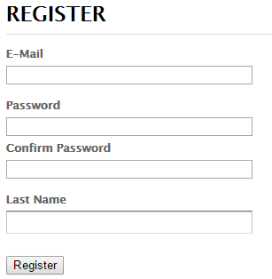
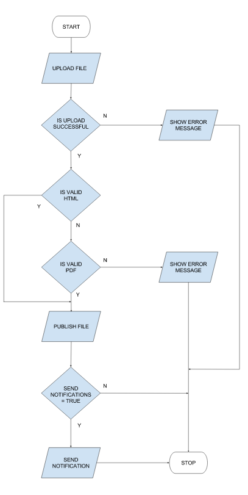

# Test for QA candidates

The purpose of this exercise is to demonstrate your abilities to work as quality assurance engineer. Please take up to 3 hours of your time to prepare the following tasks. Please upload your answers to the repository. Based on this information we will decide on the next steps in the recruitment process.

Thank you for your time and we are looking forward to your reply.
Good luck! If you have any questions please write us a message on recruitment@cognifide.com

### Before you start

1. Fork repository - you will have your personal copy of our repository. Please push your solutions there.
2. Install tools for GIT (console GitBash or Tortoisegit).
3. Push your solutions to your forked repository.

# Task 1. Test scenarios

Please write test scenarios for the visible below Registration Form component.



Single test scenario shouldn't contain more than 10 steps.
Test scenario can be written in any form.

The solution for this task should be saved in a **Task1.md** file. Please use Markdown syntax to make the file more readable.

# Task 2. DEV - QA Session

You are a QA in a team which delivers a file sharing platform. One of it's features will be uploading functionality.   

A developer from your team asks you for advice, what kind of negative functional and non-functional scenarios he should think of, during the development of file upload component.
The block diagram of file upload component is available below.



Please write down the test ideas that can help the developer to test his story before commiting it to the repository.

The solution for this task should be saved in a **Task2.md** file. Please use Markdown syntax to make the file more readable.

# Task 3. Selenium task

### Framework setup
1. Install:
	- Java 1.7 JDK,
	- Maven (Instructions: http://maven.apache.org/download.cgi#Installation),
	- IDE for Java (IntelliJ, Eclipse or NetBeans),
2. Import "Homework" project to your IDE - your project type is Maven Project.

### How to run sample test case
In order to check if you managed to setup your environment just change your working directory
to the project directory (where pom.xml file is) and execute following line in console:

```
	mvn clean test
```

If everything is set properly you should be able to see browser opening http://cogjob.cognifide.com/ page.

**Note:** Alternatively, if you don't know how to setup the project and you are not familiar with programming you can use Firefox add-on (Selenium IDE). In that case please send us exported .html files

### Create new test

Please add new test case that will test the following:

| No        | Description           | Result  |
|:-------------:|:-------------:|:-----:|
| 1 | Navigate to forked repository page (e.g. http://cogjob.cognifide.com/users/jan.kowalski/repos/homework/browse) | Page title is `Log in - Cognifide Recruitment Stash` |
| 2 | Log in with provided user credentials| Page title is `Browse Jan Kowalski / Homework - Cognifide Recruitment Stash`|
| 3 | Click `Branches` button from the left hand side menu | Page title is `Branches for Jan Kowalski / Homework - Cognifide Recruitment Stash`|
| 4 | Type invalid branch name into `search branches` field |`No branches match` message is displayed |

**Note:** Please replace `Jan Kowalski` with valid name.

### Still hungry for challenges?
More bonus points will be added if you solve the following:

1. There is a performance problem with provided framework, improve it to make tests run faster.
2. Please add TestNG test suite to allow test execution via TestNG.
3. Use Log4J logger to provide debug information.
4. Use Page Object Pattern, Page Factory Pattern.
5. Implement custom simple Webdriver Event Listener implementation.
6. Provide a possibility to run scripts on Chrome, Firefox and IE.
